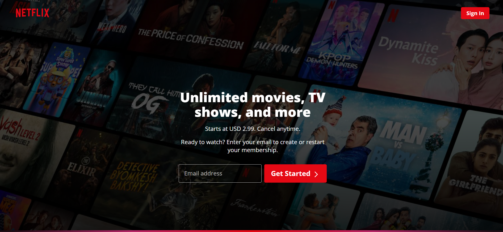
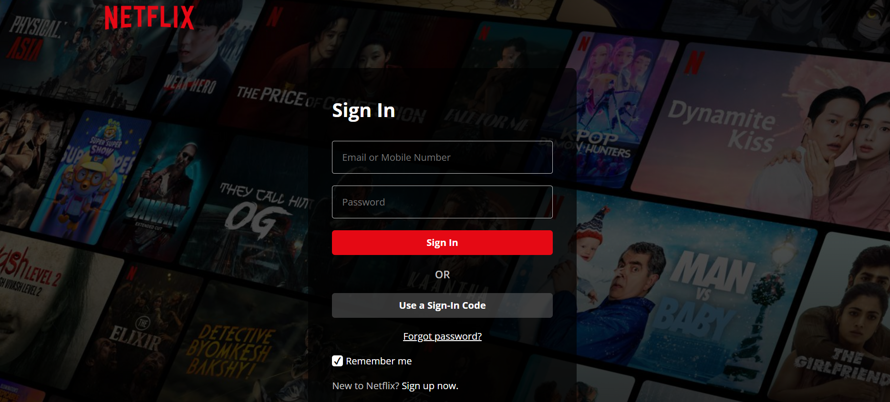

# Netflix Landing & Sign-In Page Clone

This is a desktop-only clone of **Netflix’s landing and sign-in pages** built using raw HTML5 and CSS3. The project focuses on layout, typography, and visual accuracy while learning core frontend fundamentals. Responsiveness is not yet implemented.  

## Table of contents

- [Overview](#overview)
  - [The project](#the-project)
  - [Screenshot](#screenshot)
  - [Links](#links)
- [My process](#my-process)
  - [Built with](#built-with)
  - [What I learned](#what-i-learned)
  - [Continued development](#continued-development)
- [Author](#author)

---

## Overview

### The project

This project is a **desktop-only clone of Netflix’s landing and sign-in pages**. The focus was on replicating the layout, typography, and styling using raw HTML5 and CSS3. Responsiveness and interactive features like animations are planned for future updates.  

### Screenshot

### Links

- Live Site URL: [Netflix Clone](https://ne8flix-clone-by-al-zehad.netlify.app/)
- GitHub Repo: [Netflix Clone Repository](https://github.com/al-zehad/netflix-clone)

---

## My process

### Built with

- HTML5  
- CSS3 (Flexbox, Grid, Custom Properties)

### What I learned

Through this project, I practiced and improved:

- Creating a pixel-perfect layout using HTML and CSS  
- Using Flexbox for layout alignment  
- Organizing CSS for maintainable styling  
- Replicating typography and spacing accurately  

### Continued development

Next steps for this project include:

- Making the layout fully responsive for all screen sizes  
- Adding interactive elements and animations  
- Improving CSS structure for scalability  

---

## Author

- GitHub – [Al Zehad](https://github.com/al-zehad)  
- Facebook – [Al Zehad](https://facebook.com/alzehad71)
